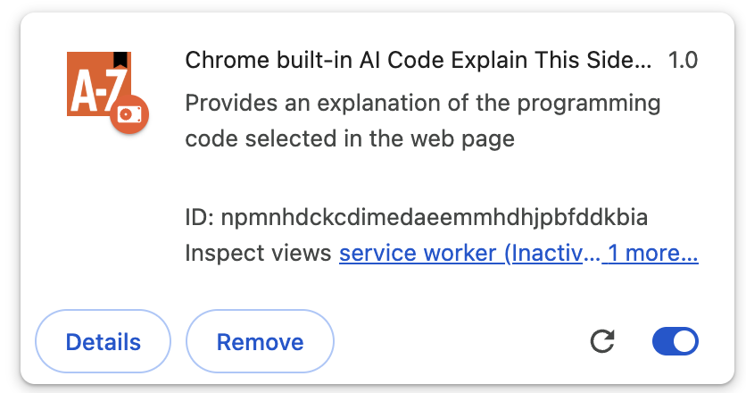
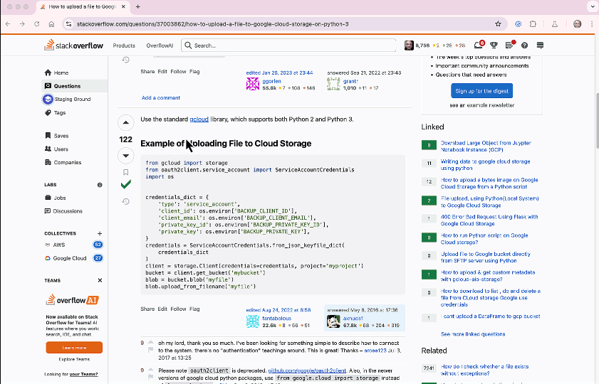

# Chrome Extension - Code Explanation

This project demonstrates a Chrome Extension, which uses the Built-in AI Prompt API to ask the model to explain a code block written in a programming language.

## Instructions on installing/running this Chrome Extension

1. Install Chrome Canary and setup the browser for Built-in Chrome AI as per the instructions [here](https://medium.com/google-cloud/get-started-with-chrome-built-in-ai-access-gemini-nano-model-locally-11bacf235514).
2. Download the entire repository to a specific folder on your local machine. 
3. In the browser location, enter `chrome://extensions`. 
4. We need to Load an unpacked extension, as per the instructions [here](https://developer.chrome.com/docs/extensions/get-started/tutorial/hello-world#load-unpacked). Simply click on `Load unpacked`, specify the root of the repository and you should be all set.
5. You should see something like this: 
   

6. Now visit any page, select a section of text from the page and then right-click and select the `Explain this code` action. This will display its analysis of the code block as shown below in the Chrome Extensions side panel. 

A sample result in shown below. 

   
